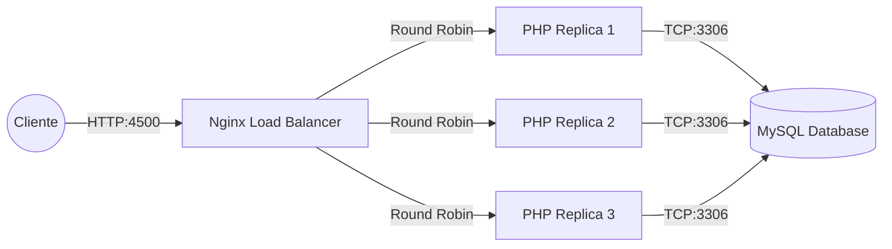

# DIO – Accenture - Desenvolvimento Java & Cloud

## 👤 Autor
**wvehuiah**  
🔗 GitHub: https://github.com/wvehuiah

---

## 🐳 Docker: Utilização Prática no Cenário de Microsserviços

Projeto desenvolvido no contexto do desafio **“Utilização Prática no Cenário de Microsserviços”**, proposto pela plataforma **DIO (Digital Innovation One)**.

🔗 [**Descrição oficial do desafio**](https://web.dio.me/lab/docker-utilizacao-pratica-no-cenario-de-microsservicos/learning/01c90219-29e6-46da-bad9-9542f621b9c2)  
<sub>Obs.: O acesso ao link requer uma conta ativa na plataforma DIO.</sub>

---  

>## Toshiro Shibakita Project: Docker Microservices Architecture

Uma implementação moderna e escalável do desafio prático "Toshiro Shibakita" da Digital Innovation One (DIO).


## 📑 Sobre o Projeto

Este projeto consiste na modernização de uma aplicação monolítica legada para uma arquitetura de **Microsserviços** containerizada. O cenário baseia-se no case "Toshiro Shibakita", onde o objetivo é garantir alta disponibilidade, escalabilidade horizontal e isolamento de serviços.

Diferente da implementação original, que dependia de IPs estáticos e configuração manual, esta versão utiliza **Service Discovery** nativo do Docker e **Balanceamento de Carga** dinâmico via Nginx.

## 🏗️ Arquitetura da Solução

O sistema foi desacoplado em três camadas distintas, orquestradas via Docker Compose:

1.  **Proxy Reverso & Load Balancer (Nginx):**
    * Ponto único de entrada (Gateway).
    * Distribui o tráfego de rede usando o algoritmo Round-Robin entre as réplicas da aplicação.
    * Resolve os endereços dos containers dinamicamente via DNS interno do Docker.

2.  **Aplicação Backend (Cluster PHP):**
    * Serviço *stateless* rodando PHP 7.4.
    * Configurado para rodar em múltiplas réplicas (Escalabilidade Horizontal).
    * Retorna o ID do container (Hostname) para validar qual nó atendeu a requisição.

3.  **Camada de Persistência (MySQL 5.7):**
    * Banco de dados isolado na rede interna.
    * Volume persistente para garantir a durabilidade dos dados (`/var/lib/mysql`).
    * Script de inicialização automática (`banco.sql`).


### Diagrama Lógico



### 🚀 Melhorias Técnicas ImplementadasRecurso

| Recurso | Implementação Original (Legado) | Minha Implementação (Refatorada) |
| :--- | :--- | :--- |
| **Endereçamento** | Hardcoded (IPs fixos no código) | **Service Discovery** (Resolução por nome de host) |
| **Escalabilidade** | Manual e estática | **Dinâmica** (via `deploy/replicas`) |
| **Segurança** | Exposição direta dos serviços | **Rede Bridge Privada** (Backend isolado) |
| **Infraestrutura** | Comandos soltos | **IaC** (Infrastructure as Code) completo |


### 🛠️ Tecnologias UtilizadasDocker

- Engine & Compose: Para containerização e orquestração.
- Nginx: Proxy reverso de alta performance.
- PHP 7.4 + MySQLi: Backend para processamento e conexão com DB.
- MySQL 5.7: SGBD Relacional.


### ⚙️ Instalação e Execução

##### Pré-requisitos
- Docker e Docker Compose instalados.

#### Passo a Passo
##### 1. **Clone o repositório:**
```Bash
git clone [https://github.com/denilsonbonatti/toshiro-shibakita](https://github.com/denilsonbonatti/toshiro-shibakita)
cd toshiro-shibakita-microservices
```

##### 2. **Suba o ambiente:** Este comando irá construir as imagens, criar a rede isolada e iniciar 3 réplicas do backend PHP juntamente com o banco de dados e o proxy.

```Bash
docker-compose up -d --build
```

##### 3. Verifique os containers:

```Bash
docker-compose ps
```

### 🧪 Validando o Load Balancer

Para provar que o sistema está distribuindo a carga entre os containers (Microsserviços), faça múltiplas requisições ao endpoint:Acesse no navegador ou use o ```curl:http://localhost:4500```

**Resposta Esperada (JSON):**

```JSON
{
  "status": "success",
  "message": "Novo registro criado",
  "host": "8a4b2c7d9e1f"
}
```

| Status da Requisição: |
|:----------------------|
| ***SUCESSO***         |
| Respondido pelo Host: |
| ***HOST_ID***         |


>Observe que o campo ```host``` muda a cada atualização, confirmando que diferentes containers estão atendendo suas requisições.

### 📂 Estrutura de ArquivosPlaintext

```PlainText
├── backend/
│   ├── Dockerfile       # Definição da imagem PHP com extensões
│   └── index.php        # Lógica da aplicação (Stateless)
├── database/
│   └── banco.sql       # Schema inicial do banco de dados
├── proxy/
│   ├── Dockerfile       # Imagem customizada do Nginx
│   └── nginx.conf       # Configuração do Upstream/Load Balancer
└── docker-compose.yml   # Orquestração dos serviços e redes
```

### 📝 Créditos

>- Desafio original proposto por [Denilson Bonatti](https://github.com/denilsonbonatti/toshiro-shibakita)
>- Refatoração proposta por [wvehuiah](https://github.com/wvehuiah)